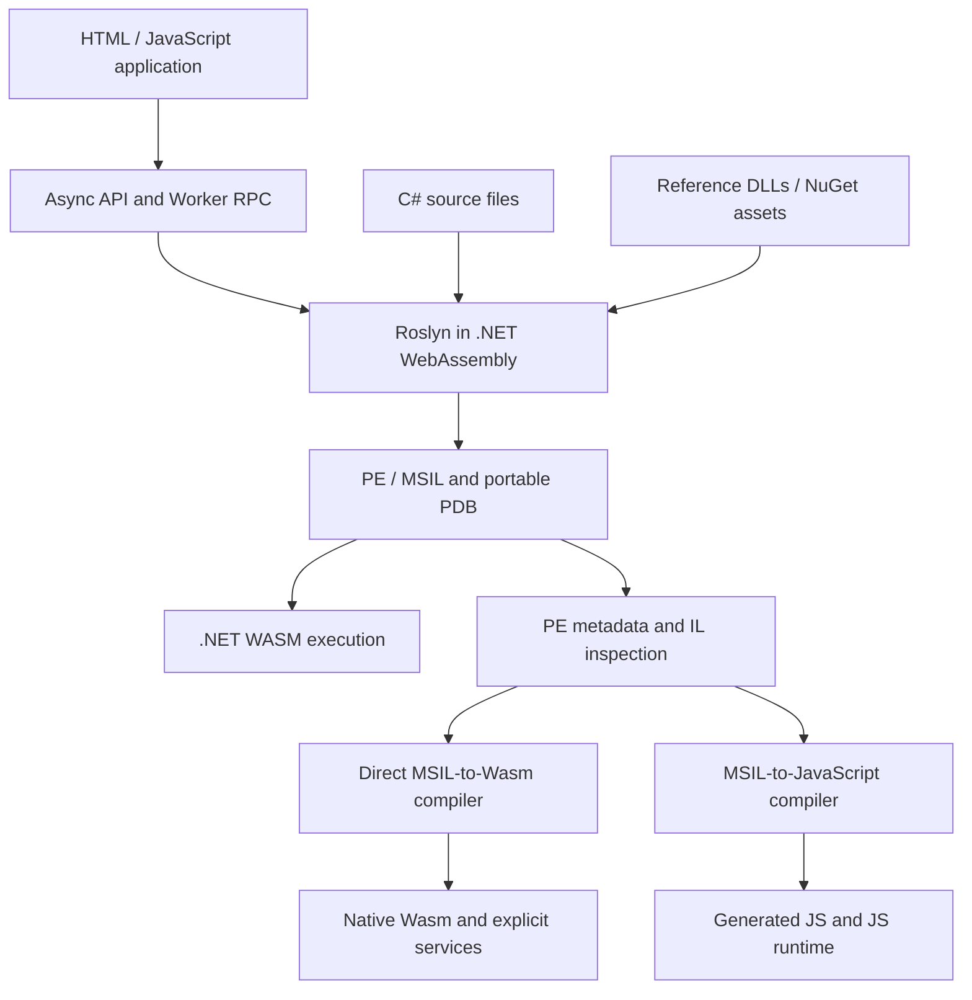

# Architecture

The compilation service is local to one JavaScript realm. By default that realm is a dedicated module Worker. The public API queues managed calls so stateful compilation, reference changes and console capture do not overlap. The host imports the .NET `dotnet.js` bootstrap from a caller-selected static path and obtains a small `JSExport` bridge.

## Compilation

The managed component embeds .NET reference-pack assemblies as resources. It creates Roslyn syntax trees from UTF-8 source text with stable paths, binds against the registered metadata references, configures `CSharpCompilationOptions`, and calls `Compilation.Emit`. Results include real PE and portable PDB bytes, compiler diagnostics, optional XML documentation, and a runtime-scoped assembly ID. The JSON ABI uses base64 for binary data; the public API converts it to typed arrays.

All compilation happens in the .NET browser runtime. The project uses Blazor's WebAssembly SDK for packaging but supplies its own JavaScript API and plain HTML user interface. AOT and trimming are disabled so newly emitted IL can execute and reflection metadata remains available.

A narrowly asserted build-time adaptation makes Roslyn's PDB source-checksum factory eager. The upstream implementation queues it on a task and blocks synchronously at consumption, which is incompatible with single-thread WASM. The change, affected method, input/output hashes and exact pinned version are recorded in `dist/browser-adaptation.json`. This is the only compiler-binary behavioral adaptation applied by the build utility.

## Managed loading and execution

Compiler references and runtime implementations are distinct stores. This allows a NuGet `ref/` facade to bind a compilation while its `lib/` or `runtimes/browser-wasm/lib/` implementation executes. The bridge registers an assembly-resolution handler for uploaded dependencies, dynamically loads emitted assemblies, and invokes their entry points or explicitly named static methods. Generated synchronous wrappers for async entry points are bypassed so the original task can be awaited without blocking.

A semaphore serializes execution and scoped output capture. Success and failure responses include output streams; errors include managed type, message and stack. Static method argument conversion uses the declared CLR parameter types. Ambiguous JSON-compatible overloads are rejected. Int64 and UInt64 values use explicit JSON tags and are revived as BigInt in JavaScript. Persistent object handles retain CLR identity across calls. Invocation supports generic arguments, optional parameters, explicit parameter types and ref/out values. Delegates and all CLR types are not exposed as automatic JavaScript proxies; wrappers remain useful for application-specific contracts.

A runtime owns loaded assemblies until it is destroyed. Default-worker disposal releases the realm and WASM memory. Direct mode cannot unload those resources independently. CLR assemblies loaded under the same identity retain normal runtime loading/static-state constraints; use distinct assembly names for independently compiled revisions or restart the worker when isolation is needed.

## MSIL-to-JavaScript translation

The metadata inspector reads PE images without executing them. It resolves types, methods, member signatures, generic metadata, fields, method bodies, exception regions, branches and constant data. An assembly model contains no guessed source reconstruction: its inputs are actual CLI metadata and instruction bytes.

The JS compiler analyzes every method, branch target, instruction and referenced method signature. It groups instructions into basic blocks and emits per-method JavaScript with explicit branch continuations. A typed analysis selects eligible static Int32 leaf methods for unboxed local and stack-slot code. Other methods retain tagged numeric values and general managed stack/local operations. The reference lowering remains selectable with `optimize:false`, and `optimize:'blocks'` isolates block grouping from numeric specialization. A JS runtime supplies numeric stack categories, object/field/array storage, calls and virtual resolution, supported framework adapters, exception unwinding, and an instruction budget. Tagged Int32/Int64/float values prevent JavaScript's default numeric coercions from silently replacing IL semantics.

`compileJavaScriptModule` constructs reusable functions once and creates separate runtime instances through its `createRuntime()` factory. The Worker caches these compiled functions by exact input, dependency identities and options while creating fresh state for each high-level run. `compileAssembly` provides the immediate compile-and-create convenience API. `generateModule` emits ES module source with static function declarations and a factory. Generated modules depend only on the JavaScript runtime support files and their explicitly linked assemblies/externals; they do not retain a Roslyn or .NET WASM dependency.

Analysis is intentionally finite. Unsupported opcodes and unresolved method signatures become explicit diagnostics. The high-level exporter defaults to strict rejection. Auto execution selects a backend before any user instruction runs, and does not retry after a potentially side-effecting failure. The .NET execution tier remains the path for framework behavior beyond the JS implementation.

## Packages

The package loader reads ZIP central-directory records, validates bounds/path/CRC information, inflates stored/deflated entries, reads nuspec XML without entity expansion, and chooses compatible framework/runtime assets. Its resolver intersects version constraints across the dependency graph and backtracks when necessary. Restore results include the resolved graph, separate compile/runtime assets, warnings, and a lock record.

Analyzer assets are dependency-registered before activation; actual Roslyn drivers execute classic/incremental generators and asynchronous diagnostic analyzers. Roslyn parses analyzer configuration files and supplies additional texts and options. The project layer evaluates a defined subset of SDK-style project XML, imports package props/targets, traverses references and executes supported tasks in a virtual filesystem. Unsupported custom tasks and build semantics fail explicitly. Native WASM exports can be bound to specific managed import signatures by the hosting layer. The DOM host renders an explicit widget protocol, and a transport can connect to an application-supplied remote host. No Windows compatibility server, desktop binary emulator or arbitrary native loader is included. CLR runtime availability remains an additional check after package-framework compatibility.

## Delivery and verification

The artifact includes source and a prebuilt static runtime. Source rebuilds use SDK 10.0.100, pinned package versions and the adaptation tool. The pruning script reads .NET's embedded boot manifest and only removes obsolete generated fingerprint assets that are not referenced by the active build.

Verification separates JavaScript unit tests, native managed assertions, the actual .NET WASM runtime hosted by Node, live official NuGet restore, and Worker protocol execution. Staged and deployed Chromium checks exercise browser startup, compiler APIs and sample workflows. Native .NET differential fixtures compare actual Roslyn-emitted IL across optimized and reference JavaScript/Wasm modes. Browser rendering and host policy remain target-dependent; Chromium results do not establish Safari/Firefox or every CSP configuration.

## Direct native WebAssembly pipeline

`src/wasm/analysis.mjs` resolves the reachable method graph and validates typed IL control flow. `compiler.mjs` and `binary.mjs` write an actual Wasm module with native method functions, typed stack slots, structured reducible control flow, conservative dispatcher fallback and native instruction-budget accounting. `exceptions.mjs` coordinates the search pass across active frames before finally unwinding. `filter-companions.mjs` describes native filter functions sharing the owner frame’s argument/local cells. Catch, filter and finally user instructions execute in generated Wasm. Type-initializer and reflection wrappers establish search boundaries before caller filters receive wrapped exceptions. `runtime.mjs` validates the embedded manifest, creates explicit CLR service imports when required and instantiates the native module. It never interprets user IL. Pure numeric modules need no imports.

`host.mjs` integrates inspection, registered implementation DLL linkage and emission caches through the common `src/compiler-cache.mjs` host infrastructure. Exact PE contents identify inspected models, while caller-supplied models are keyed by their complete contents; dependency identities and compiler options participate in cache keys. The compiler Worker handles source→PE→inspection→Wasm in one request. `compileToWasm` uses real Roslyn output; `emitWasm` accepts existing managed images. The existing .NET `wasm` backend and direct `native-wasm` backend retain separate names and compatibility contracts. See [NATIVE-WASM.md](NATIVE-WASM.md) for the API, module ABI, runtime services, supported boundaries, caching and measured performance.

## Shared framework values

JavaScript and native Wasm services share `src/il/standard-values.mjs`. Decimal stores a BigInt coefficient, sign and scale, avoiding binary floating-point arithmetic for decimal operators. Nullable represents absent or present underlying values and preserves CLR boxing rules. ValueTuple retains named fields, nested `Rest` values and value copies. These services implement a documented set of framework signatures; they do not replace the full CLR type system or globalization implementation. See [the value contracts](JAVASCRIPT-COMPILER.md#shared-framework-values).
